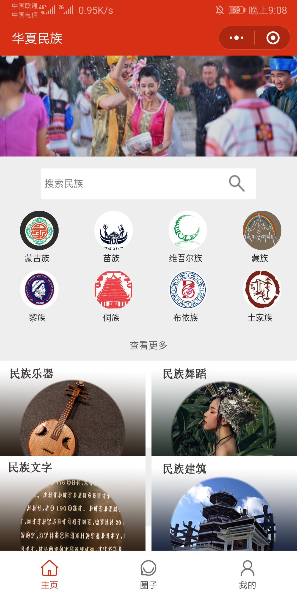
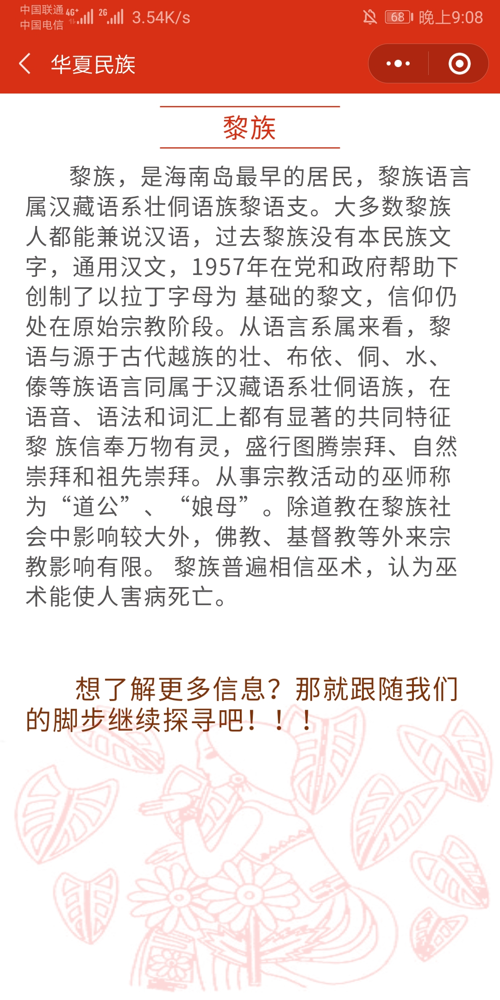
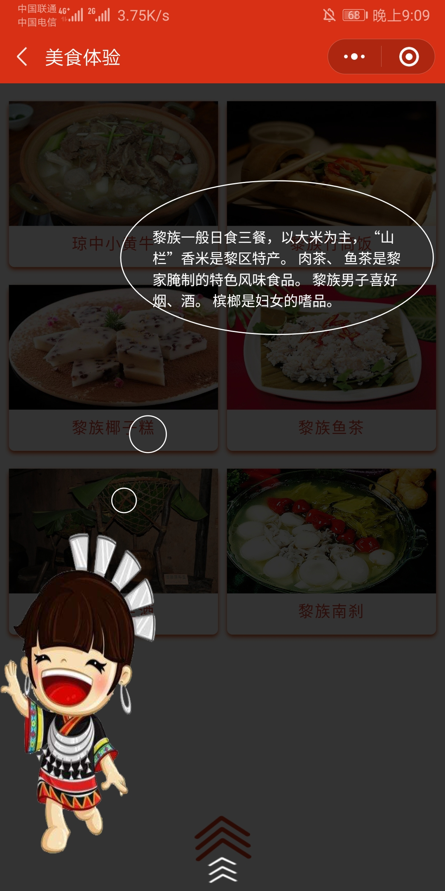
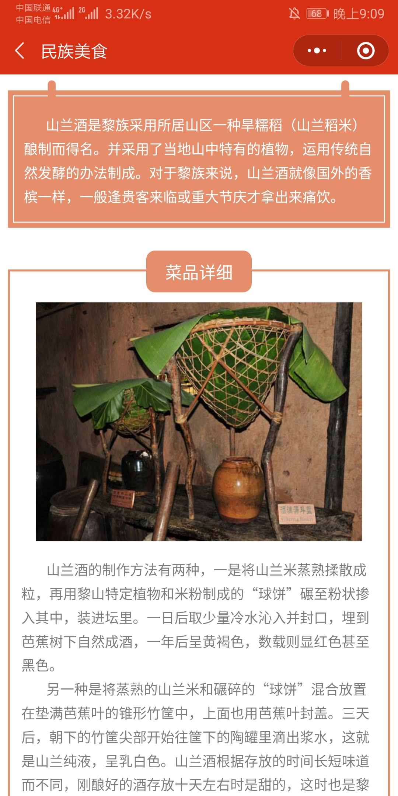

# NationTravel 民族旅行小程序

1.项目简介：
=========
（1）此小程序是一款公益性的，根据主页提供的56个民族logo信息，可以体验56个民族习俗，服饰、美食体验的小程序

（2）并提供用户以图文并茂的方式发表圈子，点赞以及收藏别人发表的内容、删除自己发表的内容

（3）在我的页面，可以查看自己收藏和发表过的东西，并可以进行删除，同时提供开发者的联系方式。

2.负责模块：
=========
（1）在队伍中任队长一职，主要使用小程序原生开发主页、民族习俗页面以及热点推荐四个子页面。

（2）后期负责修剪作品视频和编写提交文档。

3.收获总结：
=========
（1）熟悉了小程序开发的流程，对于常用组件的使用了熟于心。
4.效果图
=======
    
    
    
    
    
